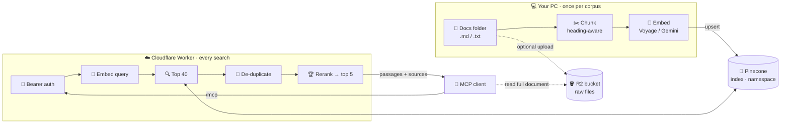

<div align="center">

# 🔭 flareRAG

**Turn any folder of documents into a search engine for MCP clients.**

Semantic search · reranking · one MCP server per collection · runs entirely on free tiers

<br>


[Quick start](#-quick-start) · [Add a corpus](#-add-a-new-corpus) · [Connect an MCP client](#-connect-an-mcp-client) · [Everyday tasks](#-everyday-tasks) · [Reference](#-reference) · [Troubleshooting](#-troubleshooting)

</div>

---

## ✨ What it does

> Point it at a folder of `.md` / `.txt` files. It indexes them once from your PC, then serves an **MCP server on Cloudflare** that any compatible client can ask questions like *"what does the collection say about X?"*. The client gets back the most relevant passages with their source files.

- 🧠 **Search by meaning**, not keywords: ask in plain English (or Hindi, or IAST Sanskrit).
- 🎯 **Two-stage retrieval**: vector search finds 40 candidates, duplicates are merged, then a reranker picks the best 5.
- 📚 **Many collections, one codebase**: each corpus is a single config file and gets its own server.
- 🔒 **Private**: every server needs a Bearer token.
- 💸 **$0 to run**: Cloudflare Workers, Pinecone Starter and Voyage's free tokens.

## 🗺️ How it works



---

## 📚 Your corpora

No private corpus configuration or documents are included in this repository. Create one from
[`corpora/example.jsonc`](corpora/example.jsonc), then keep its secret values in the matching
gitignored `corpora/<name>.env` file.

Each corpus gets its own Worker at `https://<worker>.<your-subdomain>.workers.dev`.

---

## 🚀 Quick start

Already set up? Select your corpus and go:

```bash
# 1. choose the corpus (or add --corpus <name> to any command)
#    .env →  CORPUS=corpora/mycorpus.jsonc

npm run check                 # ✅ keys, index and model all OK?
npm run ingest -- --dry-run   # 📊 how many chunks, tokens and MB?
npm run ingest                # 🧬 embed and upload to Pinecone (resumable)
npm run r2:upload             # 🪣 raw files to R2 (optional)
npm run deploy                # ☁️ publish the MCP server
```

First time here? Start with [🧰 One-time setup](#-one-time-setup).

---

## 🧩 How configuration works

```
wrangler.jsonc            ← shared: runtime, cron, default vars
      +
corpora/<name>.jsonc      ← everything about ONE corpus
      =
wrangler.generated.jsonc  ← built automatically by npm run deploy / dev / wrangler
```

| File | Holds | Git |
|---|---|:---:|
| 📄 `corpora/<name>.jsonc` | Worker name, R2 bucket, docs folder, **Pinecone host + namespace**, **embedding model**, token placeholder, chunking, descriptions | ✅ |
| 🔐 `corpora/<name>.env` | Secret values referenced by placeholders such as `MCP_TOKEN` | ❌ |
| ⚙️ `wrangler.jsonc` | Shared Worker settings plus default vars (provider, dimensions, rerank model) | ✅ |
| 🔐 `.env` | API keys, plus `CORPUS=corpora/<name>.jsonc` (the default corpus) | ❌ |
| 🔐 `.dev.vars` | API keys for local `npm run dev` | ❌ |
| 📒 `.ingest-manifest.<name>.json` | Ingest progress. **Keep it**: it's how re-runs skip unchanged files | ❌ |
| 📒 `.r2-uploaded.<name>.txt` | R2 upload progress | ❌ |

> [!TIP]
> **Switching corpus** takes one line: change `CORPUS=` in `.env`. For a single command, add `-- --corpus <name>`, e.g. `npm run check -- --corpus mycorpus`.

> [!IMPORTANT]
> A var in the corpus file **overrides** the same var in `wrangler.jsonc`. API keys never go in either file. Don't run `npx wrangler deploy` directly: use `npm run deploy`, which builds the combined config.

---

## 🧰 One-time setup

**1 · Install**
```bash
npm install
cp .env.example .env
cp .dev.vars.example .dev.vars
```

**2 · Get API keys** and paste them into **both** `.env` and `.dev.vars`:

| Service | Where | Note |
|---|---|---|
| 🧬 Voyage AI | [dash.voyageai.com](https://dash.voyageai.com) | **Add a payment method** for usable rate limits. The 200M free tokens still apply |
| 🌲 Pinecone | [app.pinecone.io](https://app.pinecone.io) | The Starter plan is free |

```
VOYAGE_API_KEY=pa-...
PINECONE_API_KEY=pcsk_...
```

**3 · Log in to Cloudflare** (for deploys, secrets and R2):
```bash
npx wrangler login
```

---

## ➕ Add a new corpus

This example adds `mycorpus` from `C:/path/to/docs`. It accepts `.md`, `.markdown`, `.mdx` and `.txt` files, including subfolders.

### 1️⃣ Create a Pinecone index

In the Pinecone console, click **Create index**:

| Setting | Value |
|---|---|
| Dimension | **1024** (= `EMBED_DIMENSIONS`) |
| Metric | **cosine** |
| Type | Serverless · AWS **us-east-1** |

📋 Copy the index **host**, e.g. `mycorpus-abc1234.svc.aped-1234-a5b6.pinecone.io`.

> [!NOTE]
> You can also reuse an existing index with a different `PINECONE_NAMESPACE`. The free plan's 2 GB is shared by all indexes, so a separate index is about organisation, not extra space.

### 2️⃣ Create the corpus file

```bash
cp corpora/example.jsonc corpora/mycorpus.jsonc
cp corpora/example.env.example corpora/mycorpus.env
```

```jsonc
{
  "worker": "mycorpus-search",        // → https://mycorpus-search.<subdomain>.workers.dev
  "r2_bucket": "mycorpus-bucket",     // optional: raw files for "read full document"
  "docs_dir": "C:/path/to/docs",      // default folder for ingest + upload

  "vars": {
    "PINECONE_INDEX_HOST": "mycorpus-abc1234.svc.aped-1234-a5b6.pinecone.io",
    "PINECONE_NAMESPACE": "docs",
    "EMBED_MODEL": "voyage-4-large",  // or voyage-4 / voyage-4-lite
    "MCP_TOKEN": "${MCP_TOKEN}",     // placeholder; real value in corpora/mycorpus.env (gitignored)

    "COLLECTION_NAME": "My corpus",
    "COLLECTION_DESCRIPTION": "…completes 'This server searches …'",
    "SEARCH_TIPS": "…how to phrase good queries",
    "EXAMPLE_QUERY": "…an example question"
    // "CHUNK_MIN_SIZE": "1200"       // merge tiny heading sections
  }
}
```

🎲 Generate a token and save it in `corpora/mycorpus.env` (gitignored, next to the corpus file):
```bash
node -e "console.log('MCP_TOKEN=' + require('crypto').randomBytes(18).toString('base64url'))" >> corpora/mycorpus.env
```

> [!NOTE]
> Any `${NAME}` in the corpus vars is expanded from `corpora/<name>.env` → root `.env` → the
> environment when the corpus is loaded, so secrets never need to be committed. A missing name
> fails loudly before anything is deployed.

> [!TIP]
> Write the **description** carefully. MCP clients read it to decide *when* to use your server and *how* to phrase their searches.

### 3️⃣ Select and check

Set `CORPUS=corpora/mycorpus.jsonc` in `.env`, then:
```bash
npm run check
```
```
✅ Pinecone: dimension 1024, namespace "docs": 0 vectors
✅ Embeddings: voyage / voyage-4-large → 1024 dims
✅ Rerank: rerank-2.5 ok
```

### 4️⃣ Estimate (free, no API calls)

```bash
npm run ingest -- --dry-run
```
It shows the chunk, token and storage counts. Make sure the storage fits the 2 GB free limit together with your other corpora. If the chunks are tiny (lots of headings), set `CHUNK_MIN_SIZE`.

### 5️⃣ Ingest

```bash
npm run ingest
```
- ⏯️ **Resumable:** Ctrl+C at any time, and re-running continues where it stopped.
- ♻️ **Incremental:** later runs embed only new or changed files, and remove deleted ones.

### 6️⃣ Upload raw files (optional)

```bash
npx wrangler r2 bucket create mycorpus-bucket
npm run r2:upload
```
It shows a progress bar, is rate-limited to about 12k files per hour, skips files already uploaded, and needs no R2 keys.

### 7️⃣ Deploy

Each corpus is its own Worker, so each needs its own secrets (once):
```bash
npm run wrangler -- secret put PINECONE_API_KEY
npm run wrangler -- secret put VOYAGE_API_KEY
npm run deploy
```
🩺 Open `https://mycorpus-search.<subdomain>.workers.dev/health`; it should return `"status": "ok"`.

### 8️⃣ Connect an MCP client → [see below](#-connect-an-mcp-client)

---

## 🔌 Connect an MCP client

The server works with any client that supports MCP Streamable HTTP. The examples below cover Claude Desktop, Claude Code, and the MCP Inspector.

<details open>
<summary><b>🖥️ Claude Desktop</b></summary>

<br>

The built-in "custom connector" can't send a Bearer token, so use `mcp-remote`:

1. Go to **Settings → Developer → Edit Config** (`%APPDATA%\Claude\claude_desktop_config.json`).
2. Add one entry per corpus:
   ```json
   {
     "mcpServers": {
       "mycorpus": {
         "command": "npx",
         "args": ["-y", "mcp-remote", "https://mycorpus-search.<subdomain>.workers.dev/mcp",
                  "--header", "Authorization:${AUTH_HEADER}"],
         "env": { "AUTH_HEADER": "Bearer <MCP_TOKEN>" }
       }
     }
   }
   ```
   Keep `Authorization:${AUTH_HEADER}` exactly as written, with no space. It avoids Windows splitting the argument.
3. **Quit fully** (tray icon → Quit) and reopen.
4. Try: *"Search mycorpus for … and cite the sources."* 🎉

</details>

<details>
<summary><b>⌨️ Claude Code</b></summary>

<br>

```bash
claude mcp add --transport http mycorpus https://mycorpus-search.<subdomain>.workers.dev/mcp --header "Authorization: Bearer <MCP_TOKEN>"
```

</details>

<details>
<summary><b>🚀 Antigravity</b></summary>

<br>

```json
{
  "mcpServers": {
    "mycorpus": {
      "serverUrl": "https://mycorpus-search.<subdomain>.workers.dev/mcp",
      "headers": {
        "Authorization": "Bearer <MCP_TOKEN>",
        "Content-Type": "application/json"
      }
    }
  }
}
```

</details>

<details>
<summary><b>🔬 MCP Inspector (debugging)</b></summary>

<br>

```bash
npx @modelcontextprotocol/inspector
```
Connect with transport **Streamable HTTP** to `http://localhost:8787/mcp` (local) or the Worker URL, using the header `Authorization: Bearer <MCP_TOKEN>`.

</details>

---

## 🗓️ Everyday tasks

| I want to… | Do this |
|---|---|
| 🔀 Switch corpus | Edit `CORPUS=` in `.env` |
| 🎯 Run one command for another corpus | Add `-- --corpus <name>` |
| 📝 Add or change documents | Update the folder → `npm run ingest` → `npm run r2:upload` |
| ✏️ Change descriptions | Edit the corpus file → `npm run deploy` |
| 🧪 Try searches locally | `npm run dev` → open http://localhost:8787 |
| 🔑 Change a secret | `npm run wrangler -- secret put <NAME>` |
| 📜 Watch live logs | `npm run wrangler -- tail` |
| 🔄 Rotate the token | New `MCP_TOKEN` in `corpora/<name>.env` → `npm run deploy` → update the MCP client config |

### 🧬 Changing the embedding model

| Change | Re-ingest? |
|---|---|
| Within Voyage 4 (`voyage-4-large` ↔ `voyage-4` ↔ `voyage-4-lite`) | **No.** They share one embedding space; just `npm run deploy` |
| Another provider or family (e.g. Gemini) | **Yes:** `npm run ingest -- --force` |
| `EMBED_DIMENSIONS` | **Yes**, into a **new index** with that dimension |
| Chunking (`CHUNK_SIZE` / `CHUNK_OVERLAP` / `CHUNK_MIN_SIZE`) | **Yes:** `npm run ingest -- --force` |

---

## 📖 Reference

<details>
<summary><b>⌨️ Commands</b></summary>

<br>

All commands accept `-- --corpus <name or path>`; otherwise they use `CORPUS` from `.env`.

| Command | What it does |
|---|---|
| `npm run check` | Verify index (dimension, namespace), embedding key, rerank key |
| `npm run ingest -- [<dir>] [--dry-run] [--force] [--no-prune]` | Chunk → embed → Pinecone |
| `npm run r2:upload -- [<dir>] [--rate 3.5] [--no-skip-existing]` | Raw files → R2 via `wrangler login` |
| `npm run r2:list -- [<dir>]` | `r2-upload.json` for `wrangler r2 bulk put` (small folders) |
| `npm run deploy` | Publish the corpus's Worker |
| `npm run dev` | Run the Worker locally on :8787 |
| `npm run wrangler -- <args>` | Any wrangler command for the corpus (`secret put`, `secret list`, `tail` …) |
| `npm run typecheck` · `npm test` | TypeScript check · unit tests |

</details>

<details>
<summary><b>📄 Corpus file fields</b></summary>

<br>

| Field | Required | Purpose |
|---|:---:|---|
| `worker` | ✅ | Worker name, which becomes part of the URL |
| `r2_bucket` | | Bucket with the raw files |
| `docs_dir` | | Default folder for ingest and upload |
| `vars.PINECONE_INDEX_HOST` | ✅ | Index host |
| `vars.PINECONE_NAMESPACE` | ✅ | Namespace inside the index |
| `vars.EMBED_MODEL` | | e.g. `voyage-4-large`, `voyage-4`, `voyage-4-lite`, `gemini-embedding-001` |
| `vars.EMBED_PROVIDER` · `EMBED_DIMENSIONS` | | Defaults `voyage` · `1024` (in `wrangler.jsonc`) |
| `vars.RERANK_MODEL` | | Default `rerank-2.5`; `none` disables it |
| `vars.MCP_TOKEN` | ✅* | Bearer token — `${MCP_TOKEN}` placeholder expanded from `corpora/<name>.env` (*or a secret: `npm run wrangler -- secret put MCP_TOKEN`, not both) |
| `vars.CHUNK_SIZE` · `CHUNK_OVERLAP` · `CHUNK_MIN_SIZE` | | Defaults `2000` · `200` · `0` |
| `vars.COLLECTION_NAME` | | Short name (server name, test page title) |
| `vars.COLLECTION_DESCRIPTION` | ⭐ | What the documents are; guides MCP clients |
| `vars.SEARCH_TIPS` | | Query advice added to the search tool |
| `vars.EXAMPLE_QUERY` | | Example shown to MCP clients |

</details>

<details>
<summary><b>🛠️ MCP tools</b></summary>

<br>

| Tool | Purpose |
|---|---|
| `search_documents(query, rerank_k=5, retrieval_k=20, source?, dedupe=true)` | 🔍 Best passages with source files; duplicate copies are merged, and "also in" lists the others |
| `get_document_chunk(chunk_id)` | 🧩 One passage + metadata |
| `get_full_document(path, offset?, max_chars?)` | 📄 Whole original file from R2 (paged) |
| `list_documents(prefix?, limit?, cursor?)` | 🗂️ Browse file names |

</details>

<details>
<summary><b>🌐 HTTP routes</b></summary>

<br>

| Route | Auth | Purpose |
|---|:---:|---|
| `GET /health` | 🌍 | Status, collection, namespace, models |
| `GET /` | 🌍 | Search test page |
| `GET /search?q=…` | 🔑 | JSON results (`rerank_k`, `retrieval_k`, `source`, `dedupe`) |
| `GET /doc/<path>` | 🔑 | Raw document from R2 |
| `/mcp` | 🔑 | MCP endpoint (Streamable HTTP) |

</details>

<details>
<summary><b>💸 Free-tier budget</b></summary>

<br>

| Service | Free limit | Typical use |
|---|---|---|
| 🌲 Pinecone Starter | 2 GB total · 2M writes and 1M reads per month | About 520 MB per 100k chunks · 1 read per search |
| 🧬 Voyage | 200M tokens (one-time) | English about 4 chars/token, IAST about 2.2 · about 10k rerank tokens per search |
| ☁️ Workers | 100k requests/day | 1 per search |
| 🪣 R2 | 10 GB · 1M writes and 10M reads per month | Size of the raw files |

⏰ Each Worker runs a daily cron (`0 3 * * *`) with one tiny query, so the free index never looks idle.

</details>

<details>
<summary><b>🗂️ Project layout</b></summary>

<br>

```
corpora/*.jsonc            📄 one config file per corpus
wrangler.jsonc             ⚙️ shared Worker settings + default vars
scripts/
  ingest.ts                🧬 chunk → embed → Pinecone
  r2-upload.ts             🪣 raw files → R2 (rate-limited, resumable)
  check-setup.ts           ✅ verify keys, index, namespace
  wrangler.ts              ☁️ run wrangler for a corpus
  lib/corpus.ts            🧩 corpus config loader
src/
  index.ts                 🚪 Worker: auth, routes, keep-alive cron
  mcp/server.ts            🛠️ MCP tools + descriptions
  services/                🔧 embeddings, Pinecone, search, de-duplication, R2
  ingest/chunker.ts        ✂️ heading-aware chunker, stable chunk IDs
tests/                     🧪 chunker + dedupe tests
```

</details>

---

## 🆘 Troubleshooting

<details>
<summary><b>Show common problems and fixes</b></summary>

<br>

| 😵 Symptom | 💡 Fix |
|---|---|
| `No corpus selected` | Set `CORPUS=corpora/<name>.jsonc` in `.env`, or pass `-- --corpus <name>` |
| `⚠ .env sets PINECONE_NAMESPACE=…` | Remove non-secret settings from `.env`; they belong in the corpus file |
| `vars.PINECONE_INDEX_HOST is required` | Add the host to the corpus file |
| `Settings differ from the last ingest` | You changed the model family, dimensions or chunking: revert, or `npm run ingest -- --force` |
| `index dimension X ≠ EMBED_DIMENSIONS Y` | Recreate the index with 1024 dimensions (or match `EMBED_DIMENSIONS`) |
| Ingest slow, repeated 429s | Add a payment method in the Voyage dashboard |
| `r2:upload` shows `⏸ HTTP 429` | Normal: it waits and retries. For persistent 429s, use `--rate 2` |
| `401 Unauthorized` | The client token ≠ `MCP_TOKEN`, or `Bearer ` is missing |
| `Binding name 'MCP_TOKEN' already in use` | It's both a var and a secret: `npm run wrangler -- secret delete MCP_TOKEN` |
| Claude Desktop doesn't show the server | Quit fully from the tray; check `%APPDATA%\Claude\logs\mcp-server-<name>.log` |
| `get_full_document` → not found | Run `npm run r2:upload` for that corpus |
| `npm run dev` hangs / port 8787 busy (Windows) | `taskkill /IM workerd.exe /F`, then start again |
| `Assertion failed … async.c` (Windows) | Harmless wrangler exit bug; ignore it |

</details>

---

<div align="center">

Built with ☁️ Cloudflare Workers · 🌲 Pinecone · 🧬 Voyage AI · 🔌 Model Context Protocol

</div>
